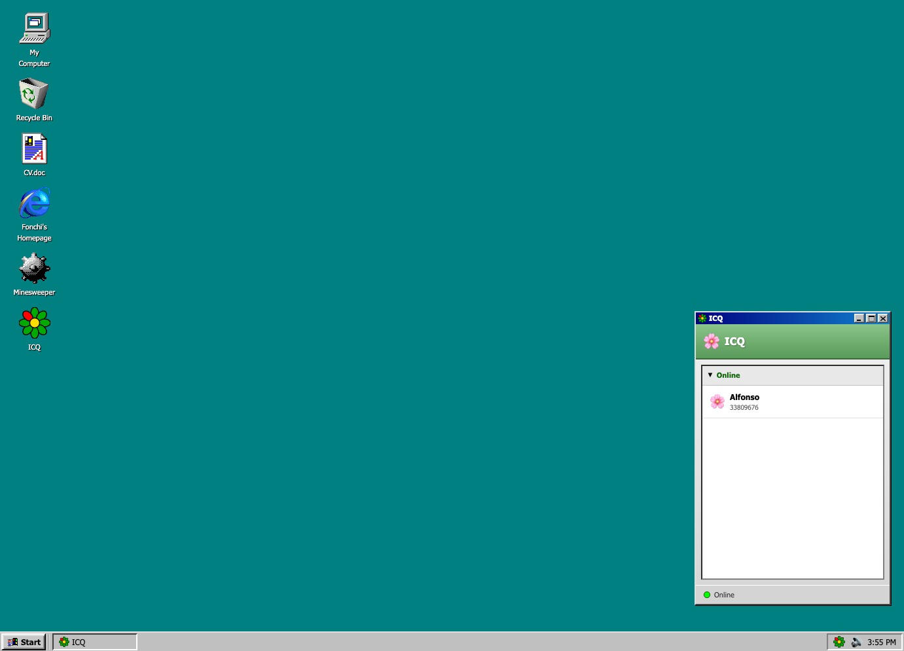

# Windows 95 Portfolio Site

A fully functional Windows 95 emulator web application that serves as an interactive portfolio experience. Built with React, TypeScript, and styled-components.

**Live Demo:** [win.ridao.ar](https://win.ridao.ar)



## Features

### Desktop Environment
- Classic Windows 95 teal desktop background
- Draggable, resizable windows with authentic styling
- Minimize/maximize/close window controls
- Taskbar with Start button, running apps, and system tray
- Desktop icons with double-click to open

### Applications

| App | Description |
|-----|-------------|
| **ICQ Messenger** | Chat with my AI digital twin powered by Gemini. Features classic ICQ flower logo, contact list, "uh-oh!" notification sound, and typing indicators. |
| **CV.doc** | View my CV in an Adobe Acrobat Reader 3.0 styled PDF viewer with page navigation and zoom controls. |
| **Fonchi's Homepage** | Browse a 90s-style personal homepage with guestbook |
| **Minesweeper** | Classic Minesweeper game |
| **My Computer** | Windows Explorer-style file browser |
| **Recycle Bin** | Empty trash can |

### Start Menu
- Programs submenu with all applications
- Documents quick access
- Settings panel
- Shut Down (redirects to terminal site)

### System Tray
- ICQ status indicator with unread message badge
- Volume mute/unmute toggle
- Real-time clock

### Boot Sequence
- Authentic Windows 95 startup screen
- Progress bar animation
- Startup sound

## Tech Stack

- **Framework:** React 18 + TypeScript
- **Build Tool:** Vite
- **UI Components:** [React95](https://react95.io/)
- **Styling:** styled-components
- **PDF Viewer:** react-pdf
- **AI Chat:** Google Gemini API via AWS Lambda
- **Hosting:** AWS Amplify

## Getting Started

### Prerequisites
- Node.js 18+
- npm or yarn

### Installation

```bash
# Clone the repository
git clone https://github.com/fonCki/win-site.git
cd win-site

# Install dependencies
npm install

# Set up environment variables
cp .env.example .env
# Edit .env with your API endpoints

# Start development server
npm run dev
```

### Build for Production

```bash
npm run build
```

## Environment Variables

Copy `.env.example` to `.env` and configure:

| Variable | Description |
|----------|-------------|
| `VITE_API_BASE_URL` | Base URL for API endpoints (chat, CV, guestbook) |
| `VITE_IP_API_URL` | IP lookup service URL (optional) |

## Project Structure

```
src/
├── components/
│   ├── Boot/           # Boot screen animation
│   ├── Desktop/        # Desktop, Taskbar, StartMenu, Icons
│   ├── Windows/        # Window management
│   └── Apps/           # Individual applications
│       ├── ICQ/        # ICQ messenger
│       ├── CVViewer/   # PDF viewer
│       ├── Browser/    # Homepage browser
│       ├── Games/      # Minesweeper
│       └── MyComputer/ # File explorer
├── services/
│   ├── chatService.ts      # Gemini API integration
│   └── guestbookService.ts # Guestbook functionality
├── hooks/
│   └── useSessionTracking.ts
└── App.tsx
```

## Related Projects

- **Terminal Site:** [alfonso.ridao.ar](https://alfonso.ridao.ar) - My CLI-style portfolio

## Author

**Alfonso Pedro Ridao**
- Website: [alfonso.ridao.ar](https://alfonso.ridao.ar)
- GitHub: [@fonCki](https://github.com/fonCki)
- LinkedIn: [alfonsoridao](https://linkedin.com/in/alfonsoridao)

## License

MIT
